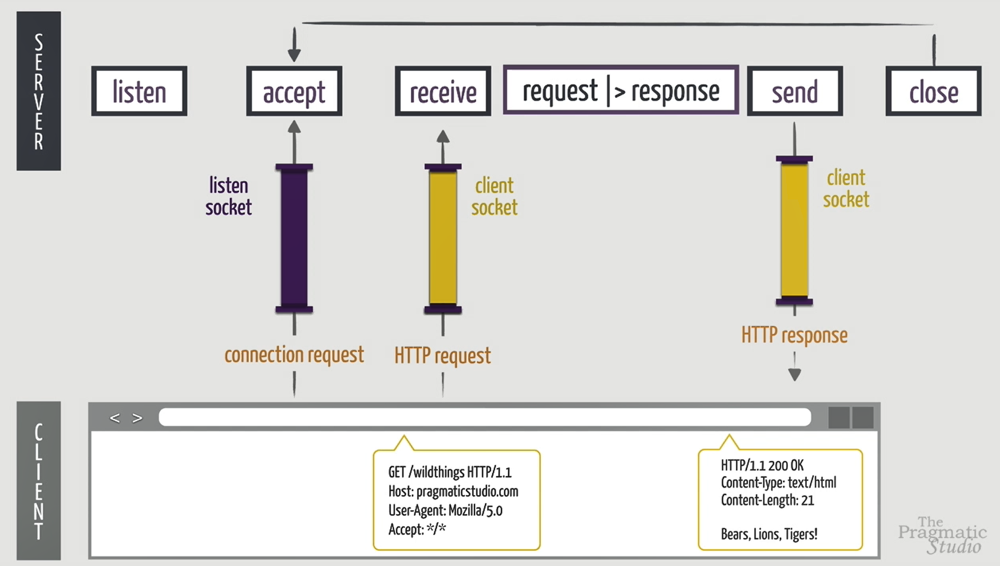
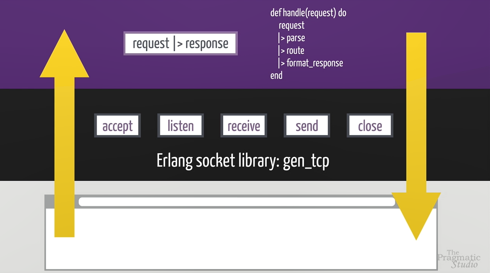
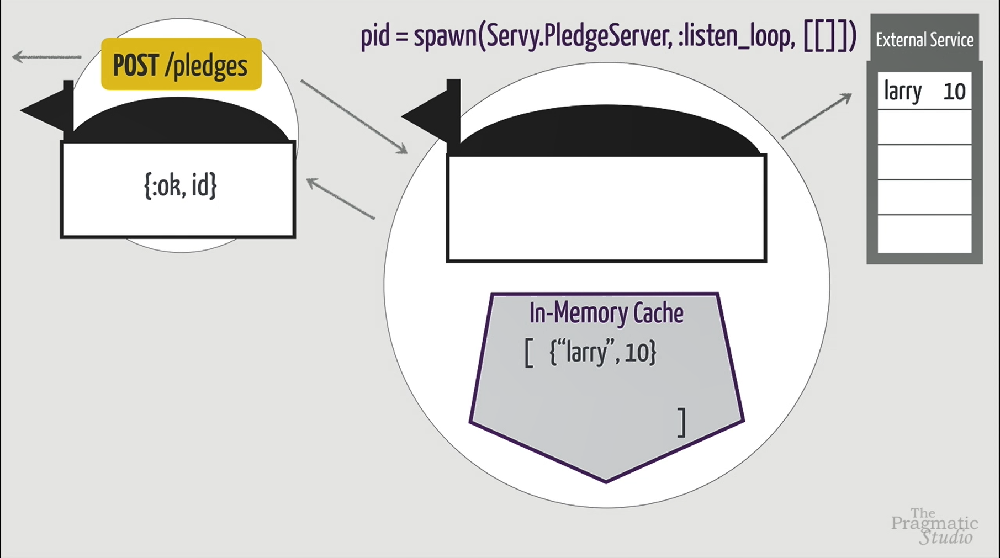
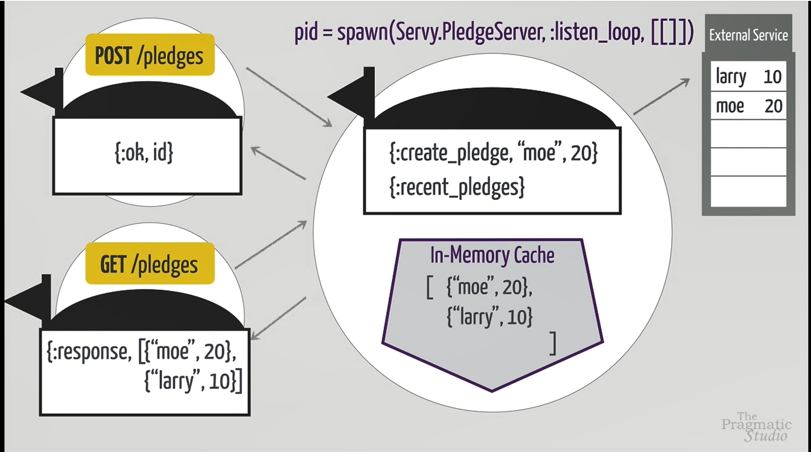

## 1.- Previous

```bash
docker run -it -v /home/ec2-user/environment/elixir_introduction:/app/data --rm elixir bash
docker run -it --rm elixir bash
sudo chown -R ec2-user ~/environment
```

```elixir
defmodule Servy do
    def handle(request) do
        request
        |> parse()
        |> rewrite_path()
        |> log()
        |> route()
        |> track()
        |> response()
    end
end
```

```elixir
Servy.Controller
Servy.Router
Servy.Handler
Servy.SensorServer
Servy.HttpServer
Servy.Supervisor
```

## 2.- Create Mix Project

Basic steps to create, edit and run an elixir project.

```bash
mix new servy
mix help
cd servy
mix test
```

Information: 

* mix.exs is the configuration file for our dependencies and requirements
* .exs: such as scripts
* .ex: compiled files
* to execute a script

```bash
elixir lib/servy.ex
```

If you want to have available your scripts in the interactive shell you can code:

```bash
iex # Start iex console
c "lib/rabbit.ex" # Compile module
r Rabbit # Recompile module
```

```bash
iex -S mix
c "lib/servy.ex"
iex lib/servy.ex
String.reverse("keep")
Servy.hello("Francisco")
Testing.sum_operation(37, 73)
r Servy
h String.split/1
```

## 3.- High Level Transformation

The convention is to create a new modules inside of _/lib_ with the name of the
project (in this case _/servy_)

```elixir
defmodule Servy.Handler do
    def handle(request) do
        # conv = parse(request)
        # conv = route(conv)
        # format_response(conv)
        
        request 
        |> parse 
        |> route 
        |> format_response
    end
    
    def parse(request) do
        # TODO: Parse the request string into a map
        conv = %{method: "GET", path: "/wildthings", resp_body: ""}
    end
    
    def route(conv) do
        # TODO: Create a new map that also has the response body
        conv = %{method: "GET", path: "/wildthings", resp_body: "Bears, Lions, Tigers"}
    end
    
    def format_response(conv) do
        # TODO: Use values in the map to create an HTTP response string
        """
        HTTP/1.1 200 OK
        Content-Type: text/html
        Content-Length: 20
        
        Bears, Lions, Tigers
        """
    end
end

request = ""
response = Servy.Handler.handle(request)

IO.puts response
```

## 4.- Pattern Matching

```elixir
iex -S mix
h String.split/2
request = Servy.Handler.handle("")
lines = String.split(request, "\n")
h List.first
first_line = Lines.first(lines)
```

h String. + tab to show the functions in String module

```elixir
request = """
GET /wildthings HTTP/1.1
Host: example.com
User-Agent: ExampleBrowser/1.0
Accept: */*

"""
String.split("1,2,3", ",")
String.split("1,2,3", parts: 2)
String.split("1 2 3", " ", trim:true)
lines = String.split(request, "\n")
first_line = List.first(lines)
first_line = request |> String.split("\n") |> List.first
parts = String.split(first_line, " ")
Enum.at(parts, 0)
```

New function using pattern matching
```elixir
  @doc"""
  Documentation for parse
  """
  def parse(request) do
    # TODO: Parse the request string into a map
    [method, path, _] =
      request
      |> String.split("\n")
      |> List.first()
      |> String.split(" ")

    %{method: method, path: path, resp_body: ""}
  end
```

## 5.- Immutable data

```elixir
conv = %{ method: "GET", path: "/wildthings", resp_body: "Bears, Lions, Tigers"}
conv[:method]
conv[:path]
conv[:resp_body]
conv[:mike]
conv[:resp_body] = "Bear"
h Map.put
new_conv = Map.put(conv, :resp_body, "Bears")
conv = % { conv | resp_body: "Bears, Lions, Tigers"}
String.length(conv.resp_body)
conv.resp_body
```

We will change route function:
```elixir
  @doc"""
  Documentation for route
  """
  def route(conv) do
    # TODO: Create a new map that also has the response body
    %{ conv | response_body: "Bears, Lions, Tigers"}
  end
```

## 6.- Function clauses

One line function

```elixir
def log(conv), do: IO.inspect conv
```

instead of

```elixir
def log(conv) do
    IO.inspect conv
end
```

if-else statement

```elixir
if conv.path == "/wildthings" do
    %{ conv | resp_body: "Bears, Lions, Tigers"}
else
    %{ conv | resp_body: "Teddy, Smokey, Paddington"}
end
```

Good way to avoid if-else (instead of use that stament you can redirect the flux)

```elixir
    def log(conv), do: IO.inspect conv
    
    def route(conv) do
        route(conv, conv.method, conv.path)
    end
    
    def route(conv, "GET", "/wildthings") do
        %{ conv | resp_body: "Bears, Lions, Tigers"}
    end
    
    def route(conv, "GET", "/bears") do
        %{ conv | resp_body: "Teddy, Smokey, Paddington"}
    end
```

## 7.- Advanced pattern matching

If you need a private function you need to name it as *defp* instead of *def*.

In the next code I have a complex function using parameter interpolation, private functions
and parameter matching:
```elixir
defmodule Servy.Handler do
    def handle(request) do
        request
        |> parse
        |> log
        |> route
        |> format_response
    end
    
    def parse(request) do
        [method, path, _] = 
            request 
            |> String.split("\n") 
            |> List.first 
            |> String.split(" ")
        %{ method: method, 
        path: path, 
        resp_body: "",
        status: nil
        }
    end
    
    def log(conv), do: IO.inspect conv
    
    def route(conv) do
        route(conv, conv.method, conv.path)
    end
    
    def route(conv, "GET", "/wildthings") do
        %{ conv | status: 200, resp_body: "Bears, Lions, Tigers"}
    end
    
    def route(conv, "GET", "/bears") do
        %{ conv | status: 200, resp_body: "Teddy, Smokey, Paddington"}
    end
    
    def route(conv, "GET", "/bears/" <> id) do
        %{ conv | status: 200, resp_body: "Bear #{id}"}
    end
    
    def route(conv, _method, path) do
        %{conv | status: 404, resp_body: "No #{path} here!"}
    end
    
    def format_response(conv) do
        """
        HTTP/1.1 #{conv.status} #{status_reason(conv.status)}
        Content-Type: text/html
        Content-Length: #{String.length(conv.resp_body)}

        #{conv.resp_body}
        """
    end
    
    defp status_reason(code) do
        %{
            200 => "OK",
            201 => "Created",
            401 => "Unauthorized",
            403 => "Forbidden",
            404 => "Not Found",
            500 => "Internal Server Error"
        }[code]
    end
end

request = """
GET /wildthings HTTP/1.1
Host: example.com
User-Agent: ExampleBrowser/1.0
Accept: */*

"""
response = Servy.Handler.handle(request)
IO.puts response

request = """
GET /bears HTTP/1.1
Host: example.com
User-Agent: ExampleBrowser/1.0
Accept: */*

"""

response = Servy.Handler.handle(request)
IO.puts response

request = """
GET /bigfoot HTTP/1.1
Host: example.com
User-Agent: ExampleBrowser/1.0
Accept: */*

"""

response = Servy.Handler.handle(request)
IO.puts response

request = """
GET /bears/1 HTTP/1.1
Host: example.com
User-Agent: ExampleBrowser/1.0
Accept: */*

"""

response = Servy.Handler.handle(request)
IO.puts response

request = """
GET /bears/1/long/path HTTP/1.1
Host: example.com
User-Agent: ExampleBrowser/1.0
Accept: */*

"""

response = Servy.Handler.handle(request)
IO.puts response
```

## 8.- Pattern matching maps

```elixir
conv = %{ method: "GET", path: "/wildlife"}
%{ path: "/wildlife"} = conv
%{ method: method, path: "/wildlife"} = conv
%{ method: method, path: path} = conv
```

But we can reasign a path with a given path
```elixir
def rewrite_path(%{ path: "/wildlife" } = conv) do
    %{ conv | path: "/wildthings"}
end
    
def rewrite_path(conv), do: conv
```

Now our function is:
```elixir
defmodule Servy.Handler do
    def handle(request) do
        request
        |> parse
        |> rewrite_path
        |> log
        |> route
        |> track
        |> format_response
    end
    
    def parse(request) do
        [method, path, _] = 
            request 
            |> String.split("\n") 
            |> List.first 
            |> String.split(" ")
        %{ method: method, 
        path: path, 
        resp_body: "",
        status: nil
        }
    end
    
    def rewrite_path(%{ path: "/wildlife" } = conv) do
        %{ conv | path: "/wildthings"}
    end
    
    def rewrite_path(conv), do: conv
    
    def log(conv), do: IO.inspect conv
    
    def route(%{ method: "GET", path: "/wildthings"} = conv) do
        %{ conv | status: 200, resp_body: "Bears, Lions, Tigers"}
    end
    
    def route(%{ method: "GET", path: "/bears"} = conv) do
        %{ conv | status: 200, resp_body: "Teddy, Smokey, Paddington"}
    end
    
    def route(%{ method: "GET", path: "/bears/" <> id} = conv) do
        %{ conv | status: 200, resp_body: "Bear #{id}"}
    end
    
    def route(%{ path: path} = conv) do
        %{conv | status: 404, resp_body: "No #{path} here!"}
    end
    
    def track(%{ status: 404, path: path} = conv) do
        IO.puts "Warning: #{path} is on the loose!"
        conv
    end
    
    def track(conv), do: conv
    
    def format_response(conv) do
        """
        HTTP/1.1 #{conv.status} #{status_reason(conv.status)}
        Content-Type: text/html
        Content-Length: #{String.length(conv.resp_body)}

        #{conv.resp_body}
        """
    end
    
    defp status_reason(code) do
        %{
            200 => "OK",
            201 => "Created",
            401 => "Unauthorized",
            403 => "Forbidden",
            404 => "Not Found",
            500 => "Internal Server Error"
        }[code]
    end
end
```

## 9.- Serving Files

```elixir
h File.read/1
{:ok, contents } = File.read("pages/about.html")
contents
{:error, reason} = File.read("pages/about_us.html")
reason
```

Case example
```elixir
case <evaluation> do
    <case_1> -> <do_that>
    <case_2> -> <do_that>
    <case_3> -> <do_that>
end
```

Correct way to read the file using one dot

```elixir
    def route(%{ method: "GET", path: "/about"} = conv) do
        case File.read("././pages/about.html") do
            {:ok, content} -> 
                %{ conv | status: 200, resp_body: content}
            {:error, :enoent} -> 
                %{ conv | status: 404, resp_body: "File not found!"}
            {:error, reason} -> 
                %{ conv | status: 500, resp_body: "File error: #{reason}"}
        end
    end
```

Other correct way to read files using absolut path

```elixir
    def route(%{ method: "GET", path: "/about"} = conv) do
        file =
            Path.expand("../../pages", __DIR__)
            |> Path.join("about.html")
        case File.read(file) do
            {:ok, content} -> 
                %{ conv | status: 200, resp_body: content}
            {:error, :enoent} -> 
                %{ conv | status: 404, resp_body: "File not found!"}
            {:error, reason} -> 
                %{ conv | status: 500, resp_body: "File error: #{reason}"}
        end
    end
```

Multiclass functions

```elixir
    def route(%{ method: "GET", path: "/about"} = conv) do
        Path.expand("../../pages", __DIR__)
        |> Path.join("about.html")
        |> File.read
        |> handle_file(conv)
        
    end
    
    def handle_file({:ok, content}, conv) do
        %{ conv | status: 200, resp_body: content}
    end
    
    def handle_file({:error, :enoent}, conv) do
        %{ conv | status: 404, resp_body: "File not found!"}
    end
    
    def handle_file({:error, reason}, conv) do
        %{ conv | status: 500, resp_body: "File error: #{reason}"}
    end
```

## 10.- Module Attributes

Modules attributes for documents and constants

```elixir
@moduledoc "Handles HTTP request."

@pages_path Path.expand("../../pages", __DIR__)

@doc "Transform the request into a response."
```

## 11.- Organizing Code

Using only module separation

```elixir
defmodule Replica.Plugins do

    def rewrite_path(%{ path: "/wildlife"} = conv) do
        %{ conv | path: "/wildthings" }
    end
    
    def rewrite_path(conv), do: conv
    
    def log(conv), do: IO.inspect conv
    
    def track(%{ status: 404 } = conv) do
        IO.puts "Warning: #{conv.path} is on the loose!"
        conv
    end
    
    def track(conv), do: conv
    
end 

defmodule Replica.Handler do
    @moduledoc "Handles HTTP requests."
    
    @pages_path Path.expand("../../pages", __DIR__)
    
    @doc "Transform the request into a response."
    def handle(request) do
        request
        |> parse()
        |> Replica.Plugins.rewrite_path()
        |> Replica.Plugins.log()
        |> route()
        |> Replica.Plugins.track()
        |> format_response()
    end
end
```

Importing modules

```elixir
    import Replica.Plugins, only: [rewrite_path:1, log:1, track:1]
    
    @doc "Transform the request into a response."
    def handle(request) do
        request
        |> parse()
        |> rewrite_path()
        |> log()
        |> route()
        |> track()
        |> format_response()
    end
```

```elixir
defmodule Replica.Parser do
    def parse(request) do
        # TODO: Parse the request string into a map
        [method, path, _] = 
            request
            |> String.split("\n")
            |> List.first()
            |> String.split(" ")
        
        %{ method: method, 
            path: path, 
            resp_body: "",
            status: nil
        }
    end
end
```

```elixir
iex -S mix
r Replica.Handler
recompile
```

## 12.- Modeling with structs

We can define a struct and we can use it to generate a structure like a map
```elixir
defmodule Replica.Conv do
    defstruct [ method: "", path: "", resp_body: "", status: nil ]
end
```

Structs are a Map, but Map is not a struct

```elixir
iex -S mix
map = %{}
conv = %Replica.Conv{}
conv = %Replica.Conv{ method: "GET", path: "/bears" }
conv.method
conv.path
conv[:age] # error
conv = %{ conv | status: 200 }
%Replica.Conv{ method: method } = conv
method
is_map(conv) # true
```

Working directly
```elixir
defmodule Replica.Parser do
    def parse(request) do
        # TODO: Parse the request string into a map
        [method, path, _] = 
            request
            |> String.split("\n")
            |> List.first()
            |> String.split(" ")
        
        %Replica.Conv{ 
            method: method, 
            path: path
        }
    end
end
```

Working with alias
```elixir
defmodule Replica.Parser do

    alias Replica.Conv, as: Conv
    
    def parse(request) do
        # TODO: Parse the request string into a map
        [method, path, _] = 
            request
            |> String.split("\n")
            |> List.first()
            |> String.split(" ")
        
        %{ 
            method: method, 
            path: path
        }
    end
end
```

We can ensure that you get a struct with the Conv struct

```elixir
defmodule Replica.Plugins do

    alias Replica.Conv

    def rewrite_path(%Conv{ path: "/wildlife"} = conv) do
        %{ conv | path: "/wildthings" }
    end
    
    def rewrite_path(%Conv{} = conv), do: conv
    
    def log(conv), do: IO.inspect conv
    
    def track(%Conv{ status: 404, path: path } = conv) do
        IO.puts "Warning: #{path} is on the loose!"
        conv
    end
    
    def track(%Conv{} = conv), do: conv
    
end 
```

## 13.- Matching Heads and Tails

Remember this useful operation
```elixir
URI.decode_query("name=Baloo&type=Brown")
```

and we will use the [heads | tails] pattern:
```elixir
[heads | tails] = [1, 2, 3, 4, 5, 6]
```

## 14.- Recursion

Example of recursion
```elixir
defmodule Recurse do
    def loopy([head | tail]) do
        IO.puts "Head #{head} and Tail #{inspect(tail)}"
        loopy(tail)
    end
    
    def loopy([]), do: IO.puts "Done!"
end

Recurse.loopy([1, 2, 3, 4, 5])
Recurse.loopy([])

defmodule Factorial do
    def fun(0), do: 1
    def fun(n) when is_integer(n) and n > 0 do
        n*fun(n-1)
    end
    def fun(arg), do: "Invalid argument: #{inspect(arg)}"
end

IO.puts Factorial.fun(500)
IO.puts Factorial.fun("500")
IO.puts Factorial.fun(%{ method: "POST"})
```

Now we can manage more complex request as the next:

```elixir
request = """
POST /bears HTTP/1.1
Host: example.com
User-Agent: ExampleBrowser/1.0
Accept: */*
Content-Type: multipart/form-data
Content-Length: 21

name=Baloo&type=Brown
"""
IO.puts Janobourian.Handler.handle(request)
```

We should add a new method to handle the POST request in /bears

```elixir
  def route(%Conv{ method: "POST", path: "/bears"} = conv) do
    %{ conv | status: 200, resp_body: "POST Method"}
  end
```

The new parse function
```elixir
defmodule Janobourian.Parser do

  @doc"""
  Documentation for parse
  """

  alias Janobourian.Conv

  def parse(request) do

    [top, params_string] =
      request
      |> String.split("\r\n\r\n")

    [request_line | headers_lines] =
      top
      |> String.split("\r\n")

    headers = parse_headers(headers_lines, %{})
    params = parse_params(headers["Content-Type"], params_string)

    # TODO: Parse the request string into a map
    [method, path, _] =
      request_line
      |> String.split(" ")

    %Conv{
      method: method,
      path: path,
      resp_body: "",
      status: nil,
      headers: headers,
      params: params
    }
  end

  defp parse_headers([head | tail], headers) do
    [key, value] =
      head
      |> String.split(": ")
    headers = Map.put(headers, key, value)
    parse_headers(tail, headers)
  end

  defp parse_headers([], headers), do: headers

  defp parse_params("application/x-www-form-urlencoded", params_string) do
    params_string
    |> String.trim
    |> URI.decode_query()
  end

  defp parse_params(_, _), do: %{}

end

```

## 15.- Slicing and dicing with Enum - Part 1

Create new module for /bears operations
```elixir
  def route(%Conv{ method: "POST", path: "/bears"} = conv) do
    BearController.create(conv, conv.params)
  end

  def route(%Conv{ method: "GET", path: "/bears"} = conv) do
    BearController.index(conv)
  end

  def route(%Conv{ method: "GET", path: "/bears" <> id} = conv) do
    params = Map.put(conv.params, "id", id)
    BearController.show(conv, params)
  end
```

```elixir
defmodule Janobourian.BearController do

  alias Janobourian.Conv

  def index(%Conv{} = conv) do
    %{ conv | status: 200, resp_body: "Teddy, Smokey, Paddington"}
  end

  def show(%Conv{} = conv, %{"id" => id} = params) do
    %{ conv | status: 200, resp_body: "Bear #{id}"}
  end

  def create(%Conv{} = conv, %{ "type" => type, "name" => name} = params) do
    %{ conv | status: 200, resp_body: "Created a #{type} bear named #{name}"}
  end
end

```

We will create a bear struct and a list of wildthings
```elixir
defmodule Janobourian.Bear do
  defstruct [
    id: nil,
    name: "",
    type: "",
    hibernating: false
  ]
end

```

```elixir
defmodule Janobourian.Wildthings do
  alias Janobourian.Bear

  def list_bears do
    [
      %Bear{id: 1, name: "Teddy", type: "Brown", hibernating: true },
      %Bear{id: 2, name: "Smokey", type: "Black" },
      %Bear{id: 3, name: "Paddington", type: "Brown" },
      %Bear{id: 4, name: "Scarface", type: "Grizzly", hibernating: true },
      %Bear{id: 5, name: "Snow", type: "Polar" },
      %Bear{id: 6, name: "Brutus", type: "Grizzly", hibernating: true },
      %Bear{id: 7, name: "Rosie", type: "Brown", hibernating: true },
      %Bear{id: 8, name: "Roscoe", type: "Panda" },
      %Bear{id: 9, name: "Iceman", type: "Polar", hibernating: true },
      %Bear{id: 10, name: "Kenai", type: "Grizzly" },
    ]
  end
end

```

And we use anonymous functions and Enum module
```elixir
triple = fn(x) -> x*3 end
triple.(3)
result = Enum.map([1, 2, 3], triple)
```

Most popular Enum operations:
* concat
* count
* each
* filter
* find
* map
* reduce

## 15.- Slicing and dicing with Enum - Part 2

Version with anonymous functions
```elixir
  def index(%Conv{} = conv) do
    items =
      Wildthings.list_bears()
      |> Enum.filter(fn(b) -> Bear.is_grizzly(b) end)
      |> Enum.sort(fn(b1, b2) -> Bear.order_asc_by_name(b1, b2) end)
      |> Enum.map(fn(b) -> bear_item(b) end)
      |> Enum.join()
    %{ conv | status: 200, resp_body: "<ul>#{items}</ul>"}
  end
```

Version with the anonymous function shortcut
```elixir
  def index(%Conv{} = conv) do
    items =
      Wildthings.list_bears()
      |> Enum.filter(&Bear.is_grizzly(&1))
      |> Enum.sort(&Bear.order_asc_by_name(&1, &2))
      |> Enum.map(&bear_item(&1))
      |> Enum.join()
    %{ conv | status: 200, resp_body: "<ul>#{items}</ul>"}
  end
```

Version with the anonymous function shortcut version two
```elixir
  def index(%Conv{} = conv) do
    items =
      Wildthings.list_bears()
      |> Enum.filter(&Bear.is_grizzly/1)
      |> Enum.sort(&Bear.order_asc_by_name/2)
      |> Enum.map(&bear_item/1)
      |> Enum.join()
    %{ conv | status: 200, resp_body: "<ul>#{items}</ul>"}
  end
```

Enum and anonymous functions
```elixir
output = fn(x) -> IO.pust x end
lista = ["cam-1", "cam-2", "cam-3"]
lista |> Enum.map(&output.(&1))
# cam-1
# cam-2
# cam-3
```

## 16.- Comprehensions

Generate dynamic content. *.eex* is for embedded content.
```elixir
h EEx.eval_file/1
```

First template using Enum:
```elixir
<h1> All the Bears! </h1>

<ul>
    <%= Enum.map(bears, fn(bear) -> %>
        <li> <%= bear.name %> - <%= bear.type %> </li>
    <%= end) %>
</ul>
```

Example of comprehension
```elixir
for x <- [1, 2, 3], do: x*3
for size <- ["S", "M", "L"], color <- [:red, :blue], do: {size, color}
```

Using comprehension
```elixir
<h1> All the Bears! </h1>

<ul>
    <%= for bear <- bears do %>
        <li> <%= bear.name %> - <%= bear.type %> </li> 
    <% end %>
</ul>
```

A single integration
```elixir
<h1>Show <%= bear.name %></h1>

<p>
    Is Name hibernating? <strong><%= bear.hibernating %></strong>
</p>
```

## 17.- A peek At Phoenix

Create new phoenix project
```bash
mix phx.new refuge
cd refuge
# Then configure your database in config/dev.exs and run:
mix ecto.create
# Start your Phoenix app with:
mix phx.server
# You can also run your app inside IEx as:
iex -S mix phx.server
```

Add the resource to your browser scope in lib/refuge_web/router.ex
```bash
mix phx.gen.html Wildthings Bear bears name:string type:string hibernating:boolean 
# To run migrations
mix ecto.migrate
```

## 18.- Test Automation

Test example using macro
```elixir
defmodule JanobourianTest do
  use ExUnit.Case
  doctest Janobourian

  test "greets the world" do
    assert Janobourian.hello() == :world
    refute Janobourian.hello() == :match
  end
end
```

Unittes
```elixir
defmodule ParserTest do
  use ExUnit.Case
  doctest Janobourian.Parser

  alias Janobourian.Parser

  test "parses a list of headers fields into a map" do
    header_lines = ["A: 1", "B: 2"]
    headers = Parser.parse_headers(header_lines, %{})

    assert headers == %{ "A" => "1", "B" => "2"}
  end
end

```

Doctest
```elixir
  @doc """
  Parses the given param string of the form `key1=value1&key2=value2`
  into a map with corresponding keys and values

  ## Examples
      iex> Janobourian.Parser.parse_params("application/x-www-form-urlencoded", "key1=value1&key2=value2")
      %{"key1" => "value1", "key2" => "value2"}

      iex> Janobourian.Parser.parse_params("application/x-www-form-urlencoded", "")
      %{}

      iex> Janobourian.Parser.parse_params("", "key1=value1&key2=value2")
      %{}
  """
  def parse_params("application/x-www-form-urlencoded", params_string) do
    params_string
    |> String.trim
    |> URI.decode_query()
  end

  def parse_params(_, _), do: %{}
```

## 19.- Rendering JSON

You can put the dependencie inside *mix.exs* and run:
```bash
mix deps.get
```

In iex console
```elixir
bears = Janobourian.Wildthins.list_bears()
Poison.encode!(bears)
```

## 20.- Web Server Sockets





Earlang socket library: gen_tcp 

Earlang modules documentation: https://www.erlang.org/doc/man_index
gen_tcp documentation: https://www.erlang.org/doc/man/gen_tcp

```erlang
server() ->
  {ok, LSock} = gen_tcp:listen(5678, [binary, {packet, 0},
                                      {active, false}]),
  {ok, Sock} = gen_tcp:accept(LSock),
  {ok, Bin} = do_recv(Sock, []),
  ok = gen_tcp:close(Sock),
  ok = gen_tcp:close(LSock),
  Bin.
```

```elixir
defmodule Janobourian.HttpServer do
  def server do
    {:ok, lsock} = :gen_tcp.listen(
      5678,
      [
        :binary,
        packet: 0,
        active: false
      ])

      {:ok, sock} = :gen_tcp.accept(lsock)
      {:ok, bin} = :gen_tcp.recv(sock, 0)
      :ok = :gen_tcp.close(sock)
      :ok = :gen_tcp.close(lsock)
      bin
  end
end
```

Janobourian.HttpServer module
```elixir
defmodule Janobourian.HttpServer do
  def start(port) when is_integer(port) and port > 1023 do

    # Create a socket to listen for client connections
    # `listen_sockets` is bound to the listening sockets
    {:ok, listen_socket} = :gen_tcp.listen(
      port,
      [
        :binary,
        packet: :raw,
        active: false,
        reuseaddr: true
      ])

      # Socket options:
      # `:binary` - open the socket in "binary" mode and deliver data as binaries
      # `packet: raw` - deliver the entire binary without doing any packet handling
      # `active: false` - receive data when we're ready by calling `:gen_tcp.recv/2`
      # `reuseaddr: true` - allows reusing the address if the listener crashes

      IO.puts "\n Listening for connection requests on port #{port}...\n"

      accept_loop(listen_socket)
  end

  def accept_loop(listen_socket) do
    IO.puts "Waiting to accept a client connection...\n"

    # Suspends (blocks) and waits for a client connection. When a connection
    # is accepted, `client_socket` is bound to a new client socket
    {:ok, client_socket} = :gen_tcp.accept(listen_socket)

    IO.puts "Connection accepted!\n"

    # Receives the request and sends a response over the client socket.
    serve(client_socket)

    # Loop back to wait and accept the next connection
    accept_loop(listen_socket)
  end

  @doc """
  Receives the request on the `client_socket` and
  sends a response back over the same socket
  """
  def serve(client_socket) do
    client_socket
    |> read_request()
    |> Janobourian.Handler.handle()
    |> write_response(client_socket)
  end

  @doc """
  Receives a request on the `client_socket`
  """
  def read_request(client_socket) do
    {:ok, request} = :gen_tcp.recv(client_socket, 0)

    IO.puts "Received request:\n"
    IO.puts request

    request
  end

  @doc """
  Returns a generic HTTP response.
  """
  def generate_response(_request) do
    """
    HTTP/1.1 200 OK
    Content-Type: text/plain
    Content-Length: 6

    Hello!
    """
  end

  @doc """
  Sends the `response` over the `client_socket`
  """
  def write_response(response, client_socket) do
    :ok = :gen_tcp.send(client_socket, response)

    IO.puts "Sent response: \n"
    IO.puts response

    # Closes the client socket, ending the connection.
    # Does not close the listen socket!
    :gen_tcp.close(client_socket)
  end

end

```

## 21.- Concurrent, Isolated Processes Part 1
```elixir
pid = spawn(fn -> IO.puts "Howdy!" end
pid = spawn(fn -> :timer.sleep(10000); IO.puts "Howdy!" end)
Process.alive?(pid)
```

## 21.- Concurrent, Isolated Processes Part 2
```elixir
Process.list
Process.list |> Enum.count
:observer.start
```

Change the mix.exs to get access *:observer.start*
```elixir
  def application do
    [
      extra_applications: [:logger, :eex, :observer, :wx, :runtime_tools]
    ]
  end
```

Anonymous functions vs named functions
```elixir
pid = spawn(fn -> Janobourian.HttpServer.start(5678) end)
```

```elixir
pid = spawn(Janobourian.HttpServer, :start, [5678])
```

## 22.- Sending and receiving Messages

Information:
```elixir
send(parent_pid, {:result, "cam-1-snapshot.jpg"})
snapshot =
    receive do
        {:result, filename} -> filename
    end
```

Process as a FIFO
```elixir
snapshot1 = spawn( fn -> Janobourian.VideoCam.get_snapshot("cam-1") end)
parent = self()
snapshot1 = spawn(fn -> send(parent, {:result, "cam-1-snapshot.jpg"}) end)
Process.info(parent, :messages)
receive do {:result, filename} -> filename end
spawn(fn -> :timer.sleep(15000); send(parent, {:result, "cam-3-snapshot.jpg"}) end)
Process.info(parent, :messages)
receive do {:result, filename} -> filename end
```


## 23.- Asynchronous Tasks
To run inside iex console
```elixir
Janobourian.HttpServer.start(5678)
```

To test connections using console
```bash
curl http://localhost:5678/snapshot
```

Create a Fetcher 
```elixir
defmodule Janobourian.Fetcher do
  def async(camera_name) do
    parent = self()
    spawn(fn -> send(parent, {:result, Janobourian.VideoCam.get_snapshot(camera_name)}) end)
  end

  def get_result do
    receive do {:result, filename} -> filename end
  end
end

```

Fetcher with functions
```elixir
defmodule Janobourian.Fetcher do
  def async(func) do
    parent = self()
    spawn(fn -> send(parent, {self(), :result, func.()}) end)
  end

  def get_result(pid) do
    receive do {^pid, :result, value} -> value end
  end
end

```

Without Task module
```elixir
  def route(%Conv{ method: "GET", path: "/sensors" <> camera_name} = conv) do
    pid4 = Fetcher.async(fn -> Janobourian.Tracker.get_location("bigfoot") end)

    snapshots =
      ["cam-1", "cam-2", "cam-3"]
      |> Enum.map(&Fetcher.async(fn -> Janobourian.VideoCam.get_snapshot(&1) end))
      |> Enum.map(&Fetcher.get_result/1)

    where_is_bigfoot = Fetcher.get_result(pid4)

    %{ conv | status: 200, resp_body: inspect({snapshots, where_is_bigfoot})}
  end
```

With Task module
```elixir
  def route(%Conv{ method: "GET", path: "/sensors" <> camera_name} = conv) do
    task = Task.async(fn -> Janobourian.Tracker.get_location("bigfoot") end)

    snapshots =
      ["cam-1", "cam-2", "cam-3"]
      |> Enum.map(&Task.async(fn -> Janobourian.VideoCam.get_snapshot(&1) end))
      |> Enum.map(&Task.await/1)

    where_is_bigfoot = Task.await(task)

    %{ conv | status: 200, resp_body: inspect({snapshots, where_is_bigfoot})}
  end
```

## 24.- Stateful Server Processes parte 1







## 24.- Stateful Server Processes parte 2
```elixir
pid = spawn(Janobourian.PledgeServer, :listen_loop, [[]])
send(pid, {:create_pledge, "larry", 10})
send(pid, {:create_pledge, "moe", 20})
send(pid, {:create_pledge, "bae", 75})
send(pid, {self(), :recent_pledges})
Process.info(self(), :messages)
receive do {:response, pledges} -> pledges end
```

## 24.- Stateful Server Processes parte 3
```elixir
__MODULE__
```

```elixir
defmodule Janobourian.PledgeServer do

  @name :pledge_server

  def start do
    IO.puts "Starting the pledge server..."

    pid = spawn(__MODULE__, :listen_loop, [[]])
    Process.register(pid, @name)
    pid
  end

  def listen_loop(state) do
    IO.puts "\nWaiting for a message..."

    receive do
      {sender, :create_pledge, name, amount} ->
        {:ok, id} = send_pledge_to_service(name, amount)
        most_recent_pledges = Enum.take(state, 2)
        new_state = [{name, amount} | most_recent_pledges]
        IO.puts "#{name} pledged #{amount}"
        IO.puts "New state is #{inspect new_state}"
        send(sender, {:response, id})
        listen_loop(new_state)
      {sender, :recent_pledges} ->
        send(sender, {:response, state})
        IO.puts "Sent pledges to #{inspect sender}"
        listen_loop(state)
    end
  end

  def create_pledge( name, amount) do
    send(@name, {self(), :create_pledge, name, amount})

    receive do {:response, status} -> status end
  end

  def recent_pledges() do
    send(@name, {self(), :recent_pledges})

    receive do {:response, pledges} -> pledges end
  end

  defp send_pledge_to_service(_name, _amount) do
    # CODE GOES HERE TO SEND PLEDGE TO EXTERNAL SERVICE
    {:ok, "pledge-#{:rand.uniform(1000)}"}
  end
end
```

## 24.- Stateful Server Processes parte 4
```elixir
```

```
```

```
```

```
```

```
```

```
```

```
```

```
```

```
```

```
```

```
```

```
```

```
```

```
```

```
```

```
```

```
```

```
```

```
```